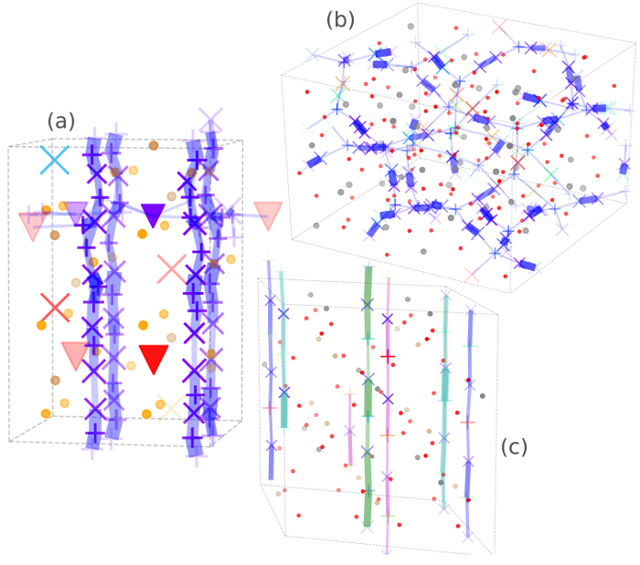

# sitator

A modular framework for conducting and visualizing site analysis of molecular dynamics trajectories.



<i> Visualizations of complete landmark site analyses, created with `sitator`, of the superionic conductors (a) LGPS, (b) LLZO, and (c) LASO. Source: figures 11, 14, and 18 from our paper, linked below. </i>


`sitator` contains an efficient implementation of our method, landmark analysis, as well as visualization tools, generic data structures for site analysis, pre- and post-processing tools, and more.

For details on the method and its application, please see our paper:

> L. Kahle, A. Musaelian, N. Marzari, and B. Kozinsky <br/>
> [Unsupervised landmark analysis for jump detection in molecular dynamics simulations](https://doi.org/10.1103/PhysRevMaterials.3.055404) <br/>
> Phys. Rev. Materials 3, 055404 – 21 May 2019

If you use `sitator` in your research, please consider citing this paper. The BibTex citation can be found in [`CITATION.bib`](CITATION.bib).

## Installation

`sitator` is built for Python >=3.2 (the older version supports Python 2.7). We recommend the use of a virtual environment (`virtualenv`, `conda`, etc.). `sitator` has one mandatory external dependency:

 - The `network` executable from [Zeo++](http://www.maciejharanczyk.info/Zeopp/examples.html) is required for computing the Voronoi decomposition. (It does *not* have to be installed in `PATH`; the path to it can be given with the `zeopp_path` option of `VoronoiSiteGenerator`.)


If you want to use the site type analysis features, the `quip` binary from an installation of [QUIP](https://libatoms.github.io/QUIP/) with [GAP](http://www.libatoms.org/gap/gap_download.html) can be used to compute the SOAP vectors. The Python 2.7 bindings (`quippy`) are **not** required. SOAP vectors can **also** be computed with [`DScribe`](https://singroup.github.io/dscribe/index.html) and the installation of QUIP avoided; note, however, that the descriptor vectors **differ** between QUIP and `DScribe` and one or the other may give better results depending on the system you are analyzing.

After downloading, the package is installed with `pip`:

```
# git clone ... OR unzip ... OR ...
cd sitator
pip install .
```

To enable site type analysis, add the `[SiteTypeAnalysis]` option (this adds two dependencies -- Python packages `pydpc` and `dscribe`):

```
pip install ".[SiteTypeAnalysis]"
```

## Examples and Documentation

Two example Jupyter notebooks for conducting full landmark analyses of LiAlSiO4 and Li12La3Zr2O12, including data files, can be found [on Materials Cloud](https://archive.materialscloud.org/2019.0008/).

All individual classes and parameters are documented with docstrings in the source code.

## Global Options

`sitator` uses the `tqdm.autonotebook` tool to automatically produce the correct fancy progress bars for terminals and iPython notebooks. To disable all progress bars, run with the environment variable `SITATOR_PROGRESSBAR` set to `false`.

## License

This software is made available under the MIT License. See `LICENSE` for more details.
